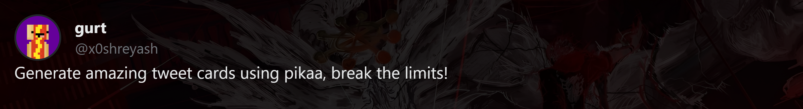

<h1 align="center">Pikaa</h1>

<p align="center">


</p>



<p align="center">
Break the 280 character limit & make tweet cards at <strong>[your-live-link-here]</strong>.
</p>

## Why Pikaa?

Tired of cropping screenshots and making crusty text images just to share long tweets? pikaa lets anyone instantly create real-looking tweet cards—no paywalls, no templates, no editing pain. Just type, customize, and share.

## Features

- Write up to 1000 characters
- Upload your own profile picture
- Customize card background and color
- Real-time preview as you type
- Fully client-side (your data never leaves your browser)
- Export as PNG (coming soon)

## Quick Start

```bash
git clone https://github.com/x0shreyash/pikaa.git
cd pikaa
```
Open `index.html` in your browser & no builds, no dependencies.

## License & Contributing

This project uses the MIT license. See the [LICENSE](LICENSE) file for details.

## Contact & Support

Found a bug or have feedback? Feel free to [text me on X](https://x.com/x0shreyash).

*Solo project — ideas and feedback are welcome!*
